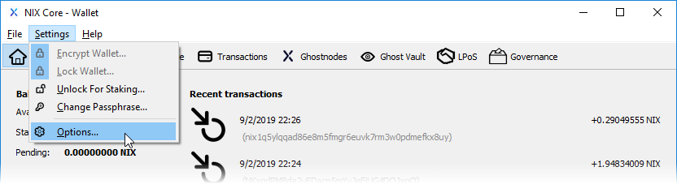

# Control de monedas

El control de monedas es una función avanzada de billetera la QT que se usa principalmente para seleccionar UTXO individuales \(salidas de transacciones no gastadas\) para usar al enviar sus monedas. Además, también puede usar el control de monedas para especificar una dirección de cambio personalizada.

## **Habilitar el control de monedas**

Para habilitar las funciones de control de monedas, primero debe navegar a la ventana Opciones en el menú Configuración.

En la ventana Opciones, seleccione la pestaña "Monedero" y marque la casilla "Habilitar funciones de control de monedas".

Ahora, cuando use la ventana "Send", notará una nueva fila etiquetada como "Funciones de control de monedas" en la parte superior.

## **Ventana de selección de monedas**

Por defecto, las entradas se seleccionan automáticamente cada vez que desea enviar monedas. Esta selección automática utilizará la menor cantidad de entradas disponibles para completar su transacción. Puede cambiar este comportamiento haciendo clic en el botón "Entradas...", que lo llevará a la ventana Selección de monedas.

Puede ver sus entradas utilizando el modo Árbol o Lista.

###  **Modo árbol**

El modo de árbol combinará todos los UTXO que usan la misma dirección para ahorrar espacio. Puede expandir el árbol haciendo clic en&gt; antes de cada casilla de verificación.

### **Modo Lista**

El modo de lista mostrará cada UTXO individual por separado.

## **Usando control de monedas**

En el siguiente ejemplo, vamos a usar el modo Árbol para seleccionar todo excepto una dirección heredada que comienza con "G".

Después de hacer clic en el botón Aceptar, volverá a la ventana Enviar.

Ahora, complete su dirección de envío y haga clic en el botón "Usar saldo disponible" para usar todas las monedas que ha seleccionado. También puede usar una cantidad menor si lo desea.

Ahora que ha ingresado una dirección y cantidad para enviar, simplemente haga clic en el botón enviar.

### **Copiando cantidades de monedas para usar en otro lugar.**

Después de seleccionar las entradas que desee, puede hacer click con el botón derecho y copiar la cantidad total si desea usarla en otro lugar, por ejemplo, al crear un contrato LPoS con las monedas UTXO seleccionadas.

## **Dirección de cambio personalizado**

El segundo uso de la función de control de monedas es especificar una dirección de cambio personalizada. Esta característica no se usa comúnmente, sin embargo, puede haber ocasiones en las que le gustaría utilizar esta capacidad.

Digamos que su billetera tiene un UTXO que contiene 20 monedas y desea enviar 19.5 a alguien. Debido a que los UTXO deben gastarse por completo, la billetera seleccionará automáticamente este UTXO para completar su transacción de tarifa de 19.5 + que lo dejaría con poco menos de .5 NIX como cambio. Normalmente, este cambio se enviaría a una dirección recién creada en su billetera como parte de la transacción. Al especificar una dirección de cambio personalizada, su cambio se enviará a cualquier dirección que elija.


**SUGERENCIA:** las direcciones de cambio creadas automáticamente no se mostrarán en el "Historial de pagos solicitados" de la ventana Recibir. La única forma de ver todas sus direcciones de cambio es mediante el uso de entradas de control de monedas.


Para habilitar esta función, simplemente marque la casilla e ingrese una dirección. **Tenga en cuenta que si se selecciona esta función y la dirección está vacía o no es válida, se utilizará una dirección de cambio recién creada.**

