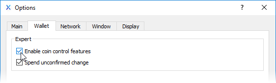

# Coin Control

Coin control is an advanced QT Wallet feature primarily used for selecting individual UTXO's \(unspent transaction outputs\) to be used when sending your coins. Additionally, you can also use coin control to specify a custom change address.

## Enabling Coin Control

In order to enable coin control features, you must first navigate to the Options window under the Settings menu.

From the Options window, select the "Wallet" tab and check the box for "Enable coin control features".

Now when you use the "Send" window, you'll notice a new row labeled "Coin Control Features" at the top..

## Coin Selection Window

By default, inputs are automatically selected whenever you want to send coins. This automatic selection will use the fewest number of available inputs to complete your transaction. You can change this behavior by clicking on the "Inputs..." button, which will take you to the Coin Selection window. 

You can view your inputs using either a Tree or List mode. 

### Tree Mode

Tree mode will combine all UTXO's that use the same address in order to save some space. You can expand the tree by clicking on the &gt; before each checkbox.

### List Mode

List mode will show each individual UTXO separately. 

## Using Coin Control

In following example we are going to use Tree mode to select everything except a legacy address which begins with "G".

After clicking the OK button, you'll be brought back to the Send window.

Now, fill in your send address and click the "Use available balance" button to use all the coins you've selected. You can also use a lesser amount if you'd like.

Now that you've entered in an address and amount to send, just click the send button.

### Copying coin amounts for use elsewhere

After selecting your desired inputs you can right click and copy the total amount if you wish to use it elsewhere, for example in creating an LPoS contract with your selected UTXO coins.

## Custom Change Address

The second use of the coin control feature is specifying a custom change address. This feature is not commonly used, however, there may be times where you'd like to utilize this ability.

Let's say your wallet has a UTXO which contains 20 coins and you wish to send 19.5 to somebody. Because UTXO's must be entirely spent, the wallet will automatically select this UTXO to complete your 19.5 + fee transaction which would leave you with just under .5 NIX as change. Normally this change would be sent to a newly created address in your wallet as part of the transaction. By specifying a custom change address, your change will be sent to any address you choose. 


**TIP:** Automatically created change addresses **will not** show up under your Receive window's "Requested payments history". The only way to view all of your change addresses is by using coin control inputs.


To enable this feature, simply check the box and enter an address. **Please note that if this feature is selected and the address is empty or invalid, a newly created change address will be used instead.**

