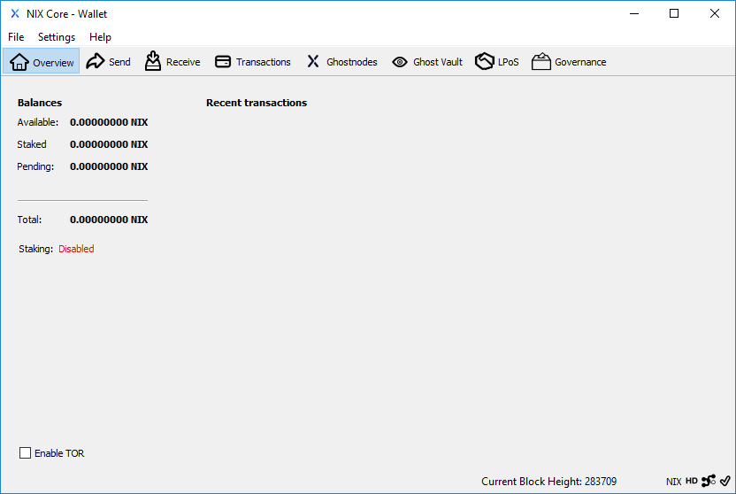

# Overview of NIX Wallets

## Available Wallets

The following wallets are currently available for download; QT, GUI, Electrum, SPV Mobile and CLI. 

The QT and GUI wallets are both based on NIX Core meaning they share the same daemon and wallet.dat \(if the default installation directory is preserved\) whereas the Electrum and SPV wallets are separate entities.

Users can have both the QT and GUI wallets installed on the same machine giving the them the ability to use the slick GUI interface for every day sending and receiving and then switch to the fully featured QT wallet for more advanced features when/if needed. For a comparison see:



## QT Wallet

The QT wallet is the one most cryptocurrency users have seen before. It offers a clean interface with a focus on functionality rather than design.



**Recommended for:** Everyone

**Download:** [https://github.com/NixPlatform/NixCore/releases](https://github.com/NixPlatform/NixCore/releases)

## GUI Wallet

True eye-candy. With a focus on user experience, the GUI wallet is perfect for users that prefer a visually pleasing interface and do not use more in-depth functionalities.


**Recommended for:** New Users and UX Enthusiasts

**Download:** [https://github.com/NixPlatform/Nix-GUI/releases](https://github.com/NixPlatform/Nix-GUI/releases)

## Electrum Wallet

A light weight wallet that supports only the basic functionalities and also runs on mobile devices. It features seed recovery and 2FA.


**Recommended for:** Everyone

**Download:** [https://github.com/NixPlatform/electrum-nix/releases](https://github.com/NixPlatform/electrum-nix/releases)

## SPV Mobile Wallets

Available for both Android and iOS, our mobile wallets have just been released. This is the most secure way to have access to your NIX on the go. 


​**Recommended for:** Mobile Users

**Download:** Available on the Google Play Store and TestFight by invitation. Alternatively you can build the wallets directly from here:  
[https://github.com/NixPlatform/nixwallet-spv-android](https://github.com/NixPlatform/nixwallet-spv-android)  
[https://github.com/NixPlatform/nixwallet-spv-ios](https://github.com/NixPlatform/nixwallet-spv-ios)

## CLI Wallet \(command line interface\)

The command line tool for those who need it. After installing, you can view all available commands by typing the following at your user prompt while having **nixd** running:

```text
nix-cli help
```

**Recommended for:** Experts and Developers

**Download:** [https://github.com/NixPlatform/NixCore/releases](https://github.com/NixPlatform/NixCore/releases)

