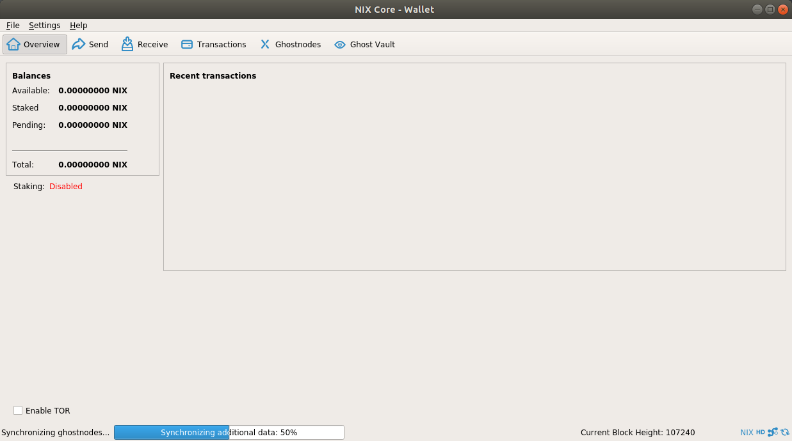

# Overview of NIX Wallets

## Summary

Quick summary of NIX wallets

Anchor links to below

## QT Wallet

The QT wallet is the one most crypto currency user have seen before. Clean interface with a focus on functionality rather than design.



**Recommended for:** everyone

**Download:** [https://github.com/NixPlatform/NixCore/releases](https://github.com/NixPlatform/NixCore/releases)

## GUI Wallet

True eye-candy. With a focus on user experience, the GUI wallet is perfect for users that prefer a visually pleasing interface and do not use more in-depth functionalities.


**Recommended for:** new users, UX enthusiasts

**Download:** [https://github.com/NixPlatform/Nix-GUI/releases](https://github.com/NixPlatform/Nix-GUI/releases)

## Electrum Wallet


**Recommended for:** users requiring only standard wallet functions, seed recovery, 2FA

**Download:** [https://github.com/NixPlatform/electrum-nix/releases](https://github.com/NixPlatform/electrum-nix/releases)

## CLI Wallet \(command line interface\)

The command line tool for all those, that need it. View all available commands by typing the following with having **nixd** running:

```text
$ ./nix-cli help
```

**Recommended for:** experts, developers, debugging

**Download:** [https://github.com/NixPlatform/NixCore/releases](https://github.com/NixPlatform/NixCore/releases)

