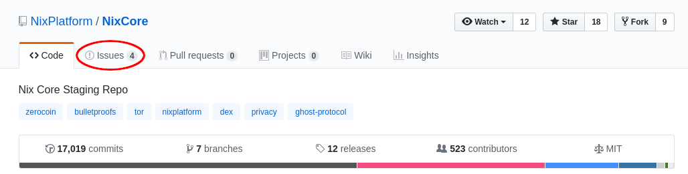

# Informar un problema de billetera

Antes de informar cualquier problema potencial, primero asegúrese de estar utilizando la versión actual del software específico en el que está experimentando el problema. También puede unirse al chat de NIX Discord y describir su problema específico en el canal de soporte apropiado para ayudar a identificar si el problema es usuario / configuración / otro error o un error real. Hacerlo también puede alertarlo sobre cualquier solución alternativa que pueda usar mientras tanto.

Si está seguro de que su problema es realmente un error, su próximo paso debe ser el repositorio NIXPlatform GitHub correspondiente, es decir: NixCore, Nix-GUI, nixwallet-spv-android, etc. Una vez allí, haga clic en la pestaña de problemas cerca de la parte superior de la página y verifique si hay un problema abierto que ya describa su problema.

Si no existe ninguno, necesitará una cuenta de GitHub para crear un nuevo problema. Esto asegurará que el equipo de desarrollo esté al tanto de su informe de error. Las cuentas son gratuitas y fáciles de configurar.

Al abrir un nuevo problema, haga todo lo posible para ser descriptivo y proporcionar cualquier extracto relevante del archivo de registro que pueda ayudar a detallar su problema. La fuente más probable para esta información se encontrará en el archivo debug.log en su directorio de datos NIX.

Los desarrolladores pueden hacer preguntas de seguimiento, así que asegúrese de responder o su problema puede cerrarse debido a la falta de información adicional solicitada.

