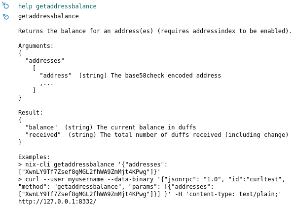

# Guía de Uso

Puede encontrar una lista de todos los comandos posibles ejecutando `nix-cli help` o viéndolos en la página Comandos de la consola.



El método de `comand` toma una lista de parámetros y devuelve la respuesta. Por ejemplo, esta sería una forma válida de fantasma \(y no fantasma\) 0.1 NIX y registrar la respuesta a la consola:

```text
//ghost 0.1 NIX and log response
client.command('ghostamountv2', '0.1').then(value => console.log(value)); 

//un-ghost 0.1 NIX and log response
client.command('unghostamountv2', '0.1').then(value => console.log(value)); 
```

Aquí hay una lista de los comandos más populares. Leyenda: `<valor_required>`, `[valor_optional]`

| Comando | Efecto |
| :--- | :--- |
| ghostamountv2 &lt;amount&gt; \[address\] | Ghost &lt;monto&gt; NIX \[al CKP externo\].  |
| unghostamountv2 &lt;amount&gt; \[address\] | Un-ghost &lt;monto&gt; NIX \[dirección externa o CKP\]. |
| getpubcoinpackv2 | Obtiene un paquete de claves de compromiso \(CKP\) para 2-Way Ghosting. |
| getblockchaininfo | Obtiene las estadísticas actuales de blockchain. |
| getstakinginfo | Obtiene las estadísticas de stake actuales. |
| sendfrom &lt;from&gt; &lt;to&gt; &lt;amount&gt; | Envía &lt;monto&gt; NIX &lt;desde la cuenta&gt; &lt;a la dirección&gt;. |
| sendtoaddress &lt;address&gt; &lt;amount&gt; | Envía &lt;monto&gt; NIX a &lt;dirección&gt;. |
| getbalance \[account\] | Obtiene el saldo de toda la billetera o solo una \[cuenta\]. |

Tenga en cuenta que siempre puede ejecutar la `help <command_name>` para obtener una explicación más detallada de los comandos:



