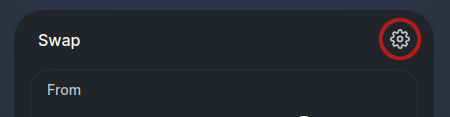
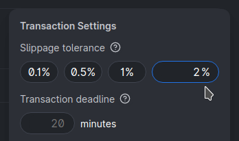
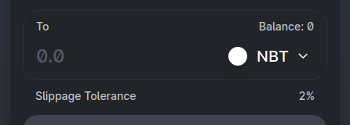

# Buy/Sell NBT Issues

If your buy or sell order is not properly completing, increase your slippage to 2%.

At [https://app.uniswap.org/\#/swap?inputCurrency=0x2e2364966267b5d7d2ce6cd9a9b5bd19d9c7c6a9](https://app.uniswap.org/#/swap?inputCurrency=0x2e2364966267b5d7d2ce6cd9a9b5bd19d9c7c6a9) do the following:

Click anywhere outside of the "Transaction Settings" dialog to close it.

Your buy/sell order should now complete.

