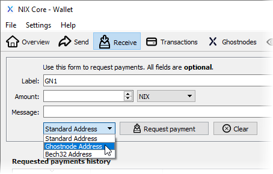
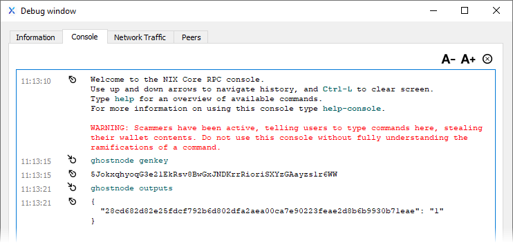
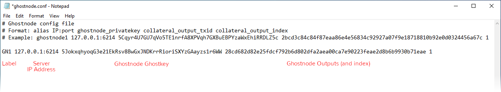
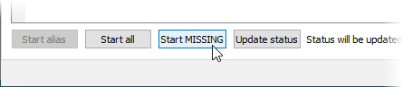

# QT Wallet

## Setup with a hosting provider

If you are using a provider, please refer to their specific setup instructions.

## Setup with your own VPS

The first thing you'll need to do is create and fund a "G" address with EXACTLY 40,000 NIX.

After clicking on "Receive", give your address a label. In this example, we'll use GN1. Next, use the pulldown menu to select "Ghostnode Address" and click the "Request payment" button.

Now, send EXACTLY 40,000 NIX to the "G" address you created. Make sure you are not subtracting the network fee from the amount when you do so.

Once the address has 40K NIX, open the console by clicking on "Help \| Debug window" in the top menu, followed by the Console tab.

Next, enter the 2 following commands:  
`ghostnode genkey`  
`ghostnode outputs`

Open the ghostnode.conf file in your nix data directory and use the information you received from the console commands to link your QT wallet with your ghostnode server.

Finally, restart your QT wallet so it is aware of the changes you made to ghostnode.conf and navigate to the Ghostnode section. Under the "My Ghostnodes" tab, you'll find your Ghostnode. Please allow the wallet to fully sync. Once all ghostnode data is fully sync'd, click on the "Start MISSING" button.

The status will change to PRE\_ENABLED and after a few minutes, ENABLED. Once that happens your Ghostnode is officially online and can begin collecting rewards.

