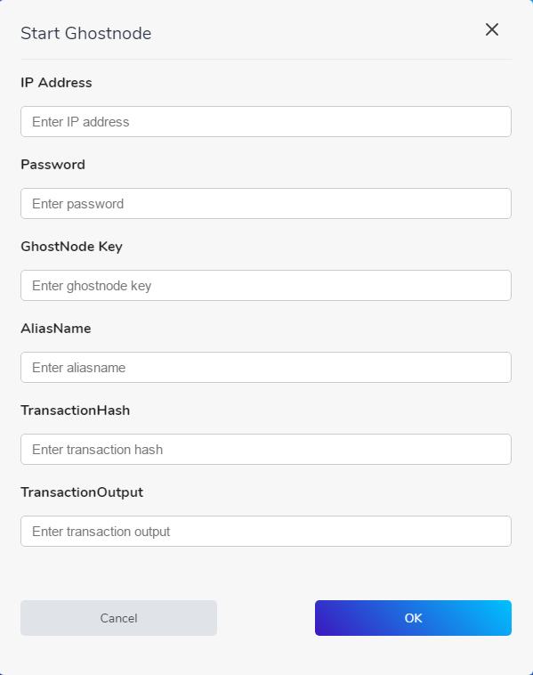

# One-Click Installer

There are two viable options for automated Ghostnode setup:

* One-Click Installer from the NIX GUI Wallet
* Bash script 

## One-Click Installer from the NIX GUI Wallet

If you have your beautiful NIX GUI Wallet running, head over to the **Ghostnode** Tab and click on **Set-Up New Node**. You will be greeted by the following screen:

Enter all the required details and click **OK** to finalize the installation.

## Bash Script from CryptoSharks

This installation is also automated but needs a bit more technical understanding of ssh connections. You can find all required information on his [GitHub Repository](https://github.com/cryptosharks131/Ghostnode).

