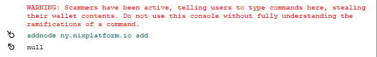

# Problemas de sincronización


**Si por alguna razón lo siguiente no soluciona su problema, únase al** [**servidor de Discord**](https://discordapp.com/invite/HGuvDTW) **y solicite ayuda en los canales públicos solo. ¡No respondas a ningún DM ya que los estafadores podrían tratar de engañarte para que les des tus fondos!**


Si se encuentra en la cadena incorrecta \(generalmente debido a que no actualizó su billetera a tiempo antes de una actualización obligatoria\), su billetera puede mostrar un saldo incorrecto y las transacciones que intente enviar no se recibirán correctamente.

## **Cómo resincronizar**

Primero, verifique que realmente está en la cadena incorrecta comparando la altura de su bloque con el [explorador](https://discordapp.com/invite/HGuvDTW). Si no coinciden, siga los siguientes pasos:

1. Asegúrese de tener la última versión de la billetera. De lo contrario, descárguelo de https://nixplatform.io/wallet o [GitHub](https://github.com/NixPlatform/NixCore/releases).

2. Asegúrese de que su billetera no se esté ejecutando y navegue hasta el directorio de datos NIX \([consulte Búsqueda del directorio de datos NIX](https://wiki.nixplatform.io/home/v/espanol/support/syncing-issues#finding-the-nix-data-directory) a continuación\).

3. Si no tiene una copia de seguridad de su archivo wallet.dat, ahora sería un buen momento para hacer una copia en caso de que la elimine accidentalmente mientras realiza el siguiente paso. Consulte la página de [Wallet Backup](https://wiki.nixplatform.io/home/v/espanol/wallet-functionality/backup-and-security-1/wallet-backup) para más detalles.

4. Elimine lo siguiente del directorio de datos:  
- bloques \(directorio completo\)  
- chainstate \(directorio completo\)  
- banlist.dat  
- peers.dat

5. Inicie la billetera y deje que se sincronice. Usando una conexión a Internet de banda ancha, debería tomar unos 15 minutos para completar.

### **Pasos opcionales**

**Descargue e instale un bootstrap después de completar el paso 4**

1. Descargue el último archivo Bootstrap de [Blockchain de NIX](https://drive.google.com/open?id=1TVljEeM6vAzEkMMESMTms9TeGa1SVCop) \(actualizado una vez al mes\).  
2. Descomprima el contenido en el directorio de datos NIX.

### **Agregar pares manualmente**

Una vez que haya reiniciado su billetera para sincronizar, puede usar la consola de depuración para agregar rápidamente un par oficial que esté geográficamente más cerca de usted escribiendo:

```text
addnode ny.nixplatform.io add
```



\*\*\*\*

**Lista de nodos oficiales:**

*  ny.nixplatform.io \(Estados Unidos\)
*  sf.nixplatform.io \(Estados Unidos\)
*  ldn.nixplatform.io \(Inglaterra\)
*  fra.nixplatform.io \(Alemania\)
*  tor.nixplatform.io \(Canadá\)
*  sgp.nixplatform.io \(Singapur\)
*  blr.nixplatform.io \(India\)

## **Encontrar el directorio de datos NIX**

#### Windows

1. Presiona la tecla de Windows + R.
2. Escribe `%appdata%` y presiona Enter.
3. Haga clic en el directorio `nix`

#### Linux

1. El directorio de datos se encuentra en `~./nix` .

#### Mac OS

1. En la barra superior, busque y haga clic en Ir -&gt; Ir a la carpeta.
2. Pegue ~ / Library / Application Support / nix / y presione Enter.

