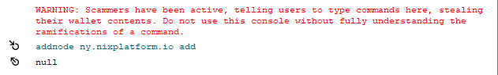

# Manually Adding Peers


If for whatever reason the following doesn't fix your issue, join the [Discord server](https://discordapp.com/invite/HGuvDTW) and ask in the **public channels only** for help. **Do not respond to any DMs** as scammers might try to trick you into giving them your funds!


## QT and GUI Wallets

You can use the debug console to quickly add an official peer that is geographically closest to you by typing:

```text
addnode node_ip_or_dns_address add
```



## **CLI Wallet**

```bash
nix-cli addnode node_ip_or_dns_address add
```

## **List of official nodes:**

* ny.nixplatform.io \(United States\)
* sf.nixplatform.io \(United States\)
* ldn.nixplatform.io \(England\)
* fra.nixplatform.io \(Germany\)
* tor.nixplatform.io \(Canada\)
* sgp.nixplatform.io \(Singapore\)
* blr.nixplatform.io \(India\)

