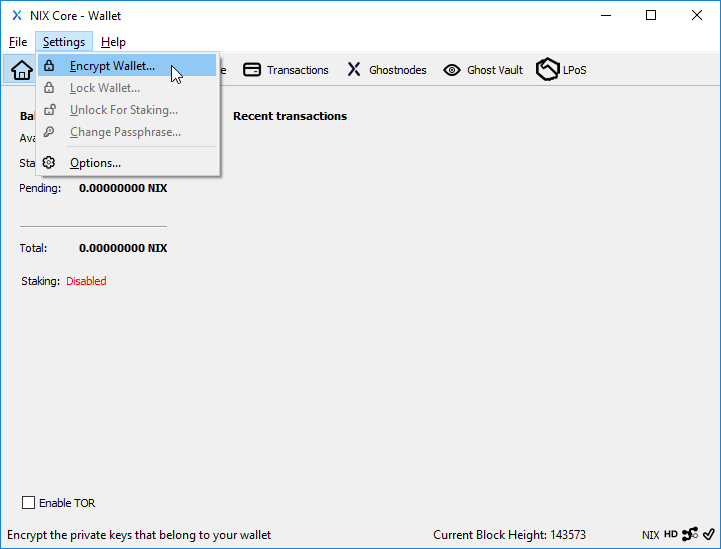
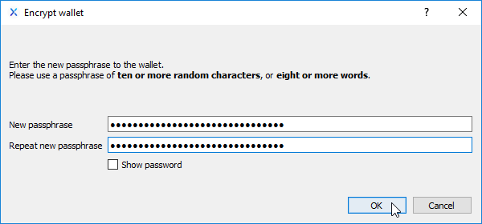
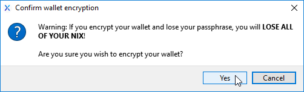
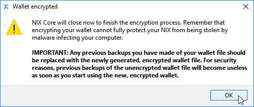

# QT/UI Wallet Encryption

## QT Wallet

The first thing you should do when starting a new nix-qt wallet is to encrypt it. From the Settings menu, select "Encrypt Wallet..." to begin the process of encrypting your wallet.dat file.

Please note: After confirming you wish to encrypt your wallet, it will take a few moments to apply the encryption.

Clicking OK on the final dialog box will close the wallet. The next time you open it, you will be required to use your passphrase in order to send or stake your NIX, so do not lose your passphrase!

