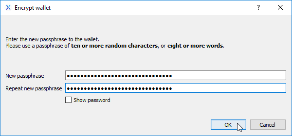

# QT Wallet Encryption

Encrypting your wallet.dat file will require that you enter a password in order to send any NIX. It is also a requirement if you wish to stake your NIX directly from your own wallet. 

Although you can perform this action at any time, it is best to do it immediately upon starting a new nix-qt wallet and before generating/using any receive addresses. More information on why can be found in the [Wallet Backup](wallet-backup.md) article.

From the Settings menu, select "Encrypt Wallet..." to begin the process of encrypting your wallet.dat file.

Please note: After confirming you wish to encrypt your wallet, it may take a few moments to apply the encryption.

Clicking OK on the final dialog box will close the wallet. The next time you open it, you will be required to use your passphrase in order to send or stake your NIX, so do not lose your passphrase!

### Changing the QT Wallet passphrase

Once your wallet is encrypted, you can later change the passphrase if you wish. From the Settings menu, select "Change Passphrase..." 

