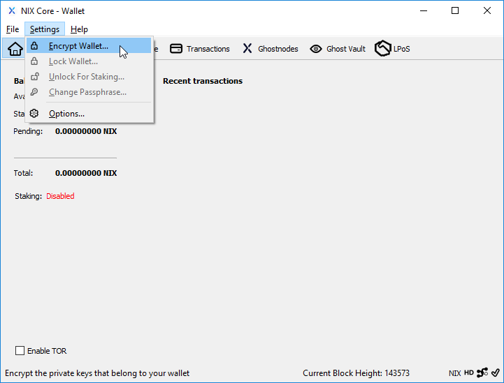

# QT Cifrado de Billetera

Cifrar su archivo wallet.dat requerirá que ingrese una contraseña para enviar cualquier NIX. También es un requisito si desea hacer staking de sus NIX directamente desde su propia billetera.

Aunque puede realizar esta acción en cualquier momento, se recomienda que lo haga inmediatamente al iniciar una nueva billetera nix-qt y antes de generar/usar cualquier dirección de recepción.

En el menú Configuración, seleccione "Encrypt Wallet" para comenzar el proceso de cifrar su archivo wallet.dat.


**NOTA:** Después de confirmar que desea encriptar su billetera, puede tomar algunos minutos aplicar la encriptación.


Al hacer click en Aceptar en el cuadro de diálogo final, se cerrará la billetera. La próxima vez que la abra, deberá usar su frase de contraseña para enviar o hacer staking de su NIX, ¡así que no lo pierda!

## **Cambiar la frase de contraseña de QT Wallet**

Una vez que su billetera está encriptada, puede cambiar la contraseña si lo desea. En el menú Configuración, seleccione "Change Passphrase..."

Asegúrese de reemplazar las copias de seguridad de su billetera antigua por la nueva.

