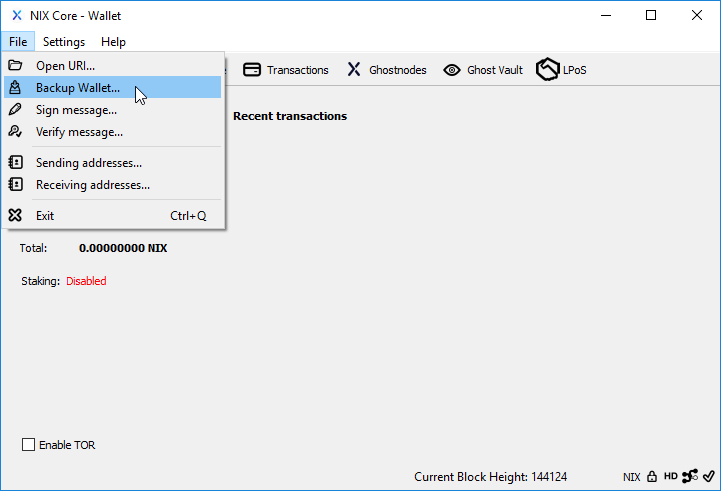

# Wallet Backup

For both the QT and UI wallets, the file wallet.dat contains your private keys which grants access to your coins on the blockchain. If this file becomes corrupted or lost you will no longer be able to access your coins without restoring a valid backup.

It is best to store your backed up wallet.dat somewhere other than the computer you normally use to run your wallet. SD cards and thumb drives are ideal candidates.

## Backup Frequency

Because all NIX wallets utilize HD key generation, you do not need to backup your wallet after generating 100 or 1000 receive addresses. All receive addresses you generate are based off of a single master private key which will grant you access to all future generated addresses.

When encrypting your wallet.dat file, a new master key is generated and used from then on. This prevents anybody who may gain access to your previously unencrypted wallet.dat file from gaining control of addresses you've generated after encryption. Because of this, encrypting your wallet will require you to create a new backup of your wallet.dat. You should also delete any previously created backups that are not encrypted.


**NOTICE:** Changing your password will not require a new backup, but any old backups will still use their respective password. Therefore, it is strongly recommended that you replace any previous wallet.dat backups.



**TIP:** A sure way to protect any coins still on an old receive address that you've generated before encrypting your wallet is to send them to yourself using a newly generated receive address after encryption.


## Manual Backup

You can manually copy your wallet.dat file to a new location by navigating to the NIX data directory and making a copy of the wallet.dat. Default locations for this file are:

#### Windows

C:\Users\\(your username\)\AppData\roaming\nix\wallet.dat

or

C:\Users\\(your username\)\AppData\roaming\nix\wallets\wallet.dat


**TIP:** Windows hides the AppData folder by default when using the graphical file explorer. In order to get inside the AppData folder, you can either type "%AppData%" into the search bar or check the box for "Hidden items" under the View menu to show hidden files in the file explorer window.


#### MacOS

~/Library/Application Support/nix/wallet.dat

or

~/Library/Application Support/nix/wallets/wallet.dat

#### Linux

~/.nix/wallet.dat

or

~/.nix/wallets/wallet.dat

## QT Wallet

You can backup your wallet.dat file from within the running nix-qt application by selecting "Backup Wallet..." from the File menu.

You will then be presented with a standard "Save file as" window where you can select a location and name for your backup file.

