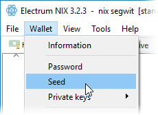
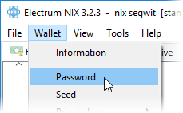
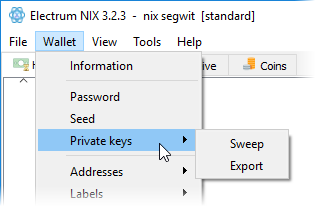

# Backup and Security

## View Your Seed Phrase

If for any reason you lose your seed phrase, you can view it again by opening the wallet and selecting "Wallet \| Seed" from the top menu. You will be prompted to enter your encryption passphrase if there is one.

## Change/Create Your Password

To change an existing password or create one if you didn't during the initial setup, select "Wallet \| Password" from the top menu.

## Private Key Control

You can access private key controls by selecting "Wallet \| Private keys" from the top menu.

### Sweep

Entering one or more private keys, you can sweep all funds they contain into any public address of your choosing.

### Export

This option will display the private keys for your public addresses and allow you to save them as a .json or .csv file type.

