# Installation and Setup

## Installation

You can download the Electrum-NIX wallet from [NIX website](https://nixplatform.io/wallet) or the [official GitHub repository](https://github.com/NixPlatform/electrum-nix/releases). Simply run the .exe or .dmg and follow the on screen instructions to install. Linux users may need to install python-pip before being able to start the wallet. Android device users can also install the .apk file.

## Initial Setup

The first time you run Electrum-NIX, you'll be prompted to create a new wallet. You should name your wallet something that is easy for you to identify. Electrum uses one address type per wallet, so for this example we will be creating a segwit wallet.

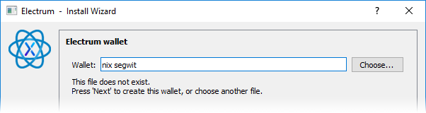

Choose the type of wallet you would like to create. Since we named the example "nix segwit", we're going to choose Segwit to create a bech32 \(nix1 address type\) Wallet. Legacy wallets use addresses that begin with G.

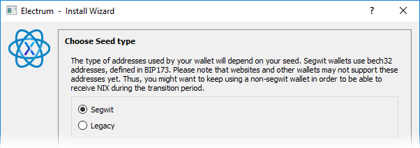

The wallet will now generate a 12 word seed phrase.

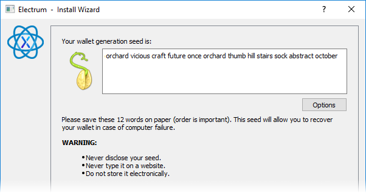

**OPTIONAL STEP:** You can extend the seed phrase with additional custom words by clicking the Options button and selecting "Extend this seed with custom words". Please note that in order to recover your funds using a different wallet, it will have to support extended custom words as well.

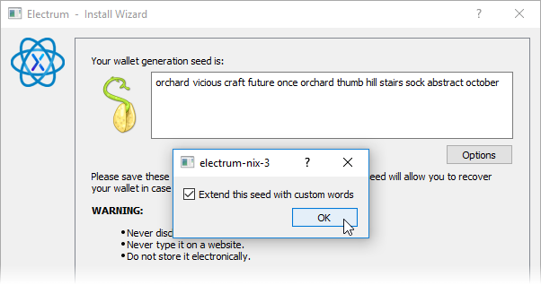

You may now choose at least 1 additional seed word to ass to the phrase.

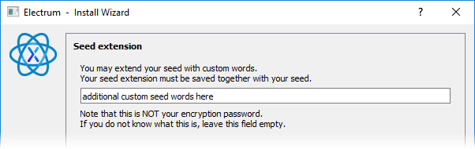

You will now be asked to confirm the 12 word seed phrase that was generated for you.

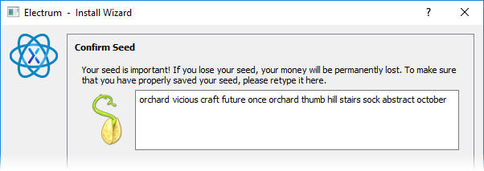

If you added any extended words to your phrase, you will be asked to input them now.

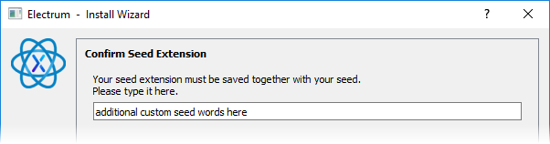

It is highly recommended that you encrypt your wallet. Choose a strong passphrase and keep it safe.

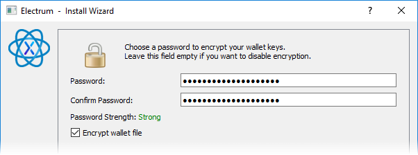

Your new wallet has now been created!

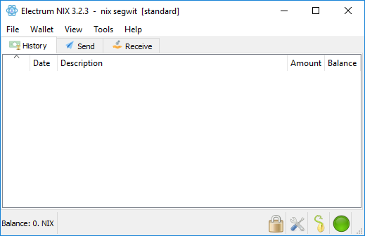

Before using your new wallet, you'll want to enable 2 options. First, because automatically calculating fees is not yet available on the network, we must enable manual fees. From the top menu, select "Tools \| Preferences".

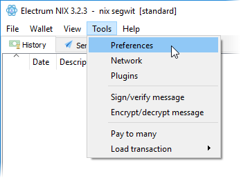

Check the box for "Edit fees manually" and click the Close button.

Next, from the top menu, select "View \| Show coins". This will give you a tab labeled "coins" that will optionally allow you to select individual inputs when sending funds similar to the coin control in the QT wallet.

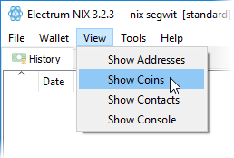

Your Electrum wallet is now ready to use!

