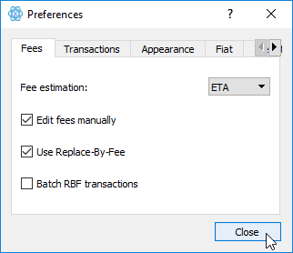

# Sending and Receiving

## Sending

### Enable Manual Fees

Because dynamic fee calculation is not yet available, you must first enable the ability to edit fees manually. If you didn't do this during the initial setup, you can do it now by selecting "Tools \| Preferences" from the top menu.

Next, check the box for "Edit fees manually".

### Sending Funds

Click on the Send tab to send funds. Enter a valid address into the Pay to field or tap on the QR icon to scan QR codes if you are using a mobile device. You can also import addresses from a file using the file folder icon.

Next, simply enter in the amount you'd like to send. You must choose a minimum of 1 sat/byte for the fee. In order to use the Max button you must first enter a fee so that the wallet can send all remaining funds.

### Using the Coins Tab

The Electrum wallet offers a more advanced way to send funds by allowing you to select specific inputs to send from while leaving others untouched. This is most useful for hardware wallet users who store their Ghostnode collateral on their Ledger or Trezor and want to send funds using only their rewards, and is very similar to the [Coin Control](../qt/advanced-wallet-functions/coin-control.md) found in the QT wallet.

If you did not set the wallet to show the Coins tab during the initial setup, you can enable it by selecting "View \| Show Coins" from the top menu.

Next, simply select your specific input, or Shift-click or Ctrl-click to select multiple inputs you wish to use for sending, then right click and select Spend.


**TIP:** Ghostnode owners who don't regularly gather/move their rewards will need to select smaller batches of inputs as opposed to selecting all of them at once in order to create a successful transaction.


The wallet will now only send funds from the inputs you've selected. After entering in a fee, the max amount of coins you can send will automatically be adjusted. You can also choose to send less than the max shown.

## Receiving

To generate a receiving address, click on the Receive tab.

You can optionally enter a description for the receiving address, request an amount and set an expiration for the request. Expirations apply to requests ONLY. Any address you generate can accept funds forever. You can save a request after entering in an optional description or amount. Clicking on the "New" button will generate a new address.

