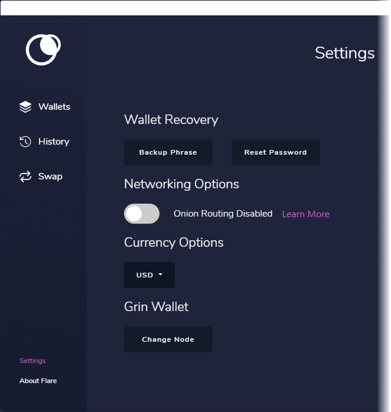
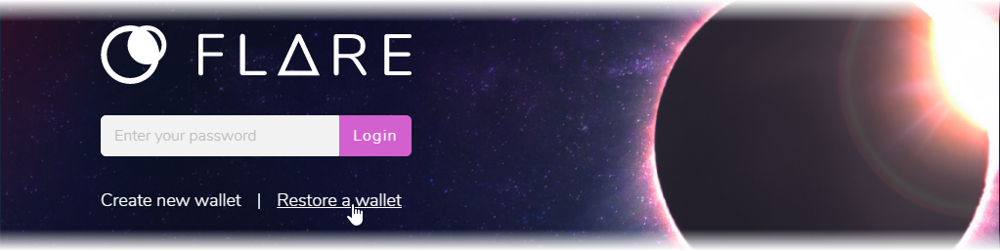

# Backup and Security

## Backup

The Flare desktop wallet uses a 12 word seed phrase that will be displayed once you first open/create your wallet. Simply write down the list of words and store them in a safe place. **It is strongly recommended that you do not store them electronically**. Without these words \(and in the proper order\), recovery is not possible.

To view your recovery phrase, click on "Settings" in the left-hand menu, then on the "Backup Phrase" button.

## Recovery

When you first open the Flare wallet, you have the option to recover a wallet using your 12 word seed phrase.

These 12 words can also be used in any BIP32/39 compliant wallet that supports NIX.

## Security

When you first create your wallet, you will be forced to choose a password. Use a strong password that only you know about.

You can change your password by clicking on "Settings" in the left-hand menu, then the "Reset Password" button.

