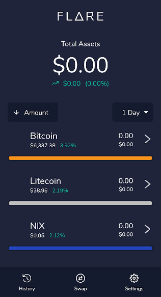

# Flare Mobile

A mobile BIP32/39 compliant multi-currency wallet which sources the best price for coin swaps using a variety of services. The Flare mobile wallet can not only control your NIX Ghostnode, but will soon also have the ability to create LPoS staking contracts.

**Recommended for:** Mobile Users









