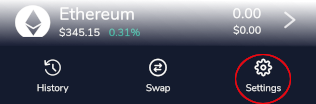
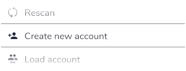
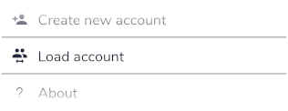

# Multiple Accounts

The Flare mobile wallet allows users to quickly create multiple accounts all based on the same seed phrase.

To create a new account, tap on Settings in the home screen.

Next, simply tap on "Create new account". After a short time, a new account will be created and loaded. New accounts apply to all supported currencies.

To switch back to your original account, or to any other additional accounts, use the "Load account" option. The original account is designated 1, followed by additional accounts 2, 3, .. \(depending on how many you create\).

