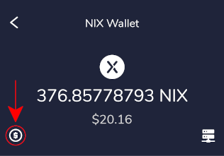
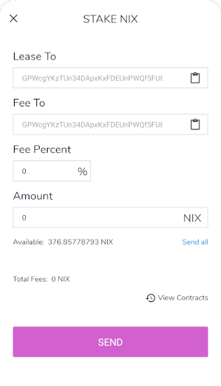
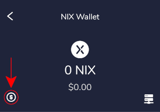
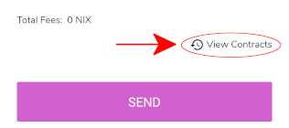
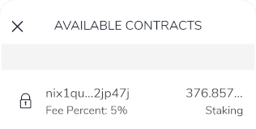
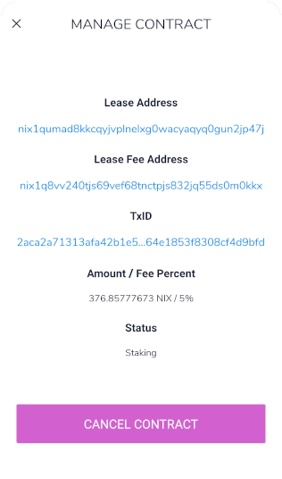

# Staking

## Creating an LPoS Contract

The Flare mobile wallet allows you to create a contract with an LPoS merchant in order to stake your coins.

To do this, open Flare and tap on the NIX wallet, followed by the $ icon.

This will bring up the contract creation window..

Here, you'll need information from your chosen LPoS merchant. Be sure that you follow their instructions carefully. Failure to do so will result in a contract that will not stake.

You can find a list of LPoS merchants here.



## Cancelling an LPoS Contract

To cancel a contract, open Flare and tap on the NIX wallet, followed by the $ icon.

Next, tap on "View Contracts".

Select the contract you wish to cancel by tapping on it.

Finally, tap on the "Cancel Contract" button.

