# 1-Way Ghosting

The procedure of sending coins to a Ghost Vault \(either your own or somebody else's\) is called “ghosting”, which essentially burns the coins and allows a user to re-issue them later as public coins with no attached history. Coins kept in the Ghost Vault remain private. The fee for ghosting your NIX is 0.25%, paid with publicly held NIX \(it does not get subtracted from your ghosted NIX\).

This feature was NIX’s first privacy transaction implementation and does not offer both sender and receiver privacy at the same time. If your transaction requires both, use [2-Way Ghosting](2-way-ghosting.md).

The Ghost Vault is currently only available in the QT and GUI wallets, with mobile wallet support planned for later release.


**TIP:** The longer your NIX are ghosted in your vault and the more ghosted NIX there are in total on the network, the stronger your privacy will be.


## QT Wallet Ghost Vault

To begin, open your qt-nix wallet and click on the "Ghost Vault" button and be sure you are looking at the "Ghost NIX to Vault" tab.

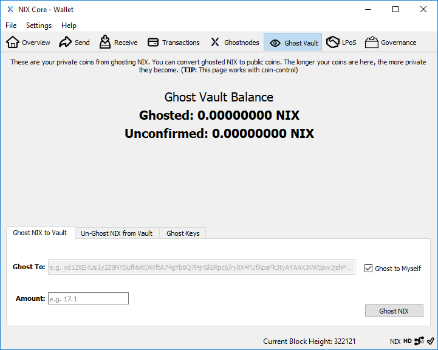

### Sending to your own Ghost Vault

By default, your NIX will be ghosted to your own Ghost Vault. Outside observers will be unable to tell that you still maintain possession of them.

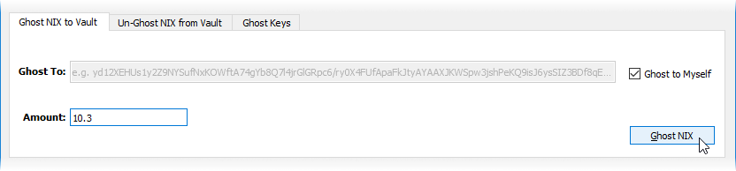

### Ghosting to another users Ghost Vault

If you'd rather send your public NIX to a different wallet, uncheck the "Ghost to Myself" box and paste in the recipients Ghost Key.

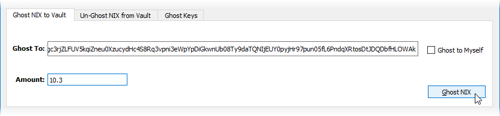


**NOTE:** Fractional amounts are currently only available in .1 increments.


Your ghosted NIX will show as unconfirmed while still in the memory pool waiting to be added to the blockchain. Once they are added to the blockchain they will show as Ghosted.

The above examples of 1-Way Ghosting will privatize the transaction as shown:

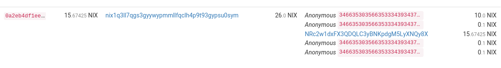

### Un-Ghosting to another users wallet

In cases where you only want to privatize your sending address, you can Un-Ghost funds from your Ghost Vault into a receivers public address. This method is done from the "Un-Ghost NIX from Vault" tab, and there is no fee for this type of transaction.

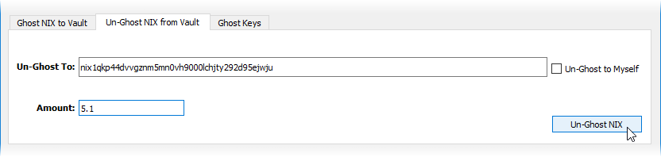

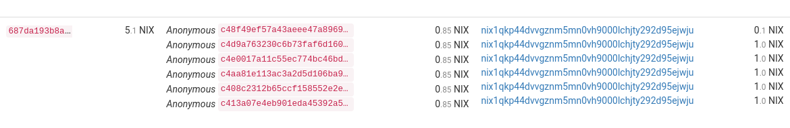

## GUI Wallet Ghost Vault

The GUI wallet currently only supports adding funds to your own Ghost Vault, and can be done in 2 ways..

### From the Overview screen

Within the Ghost Vault overview, click on the "Deposit" button.

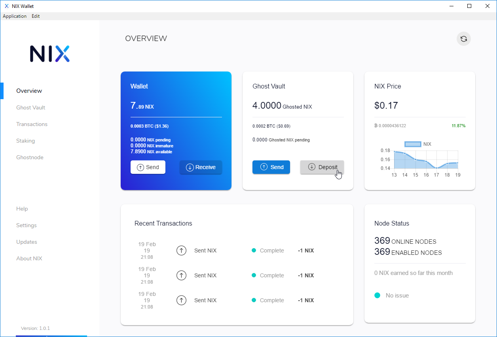

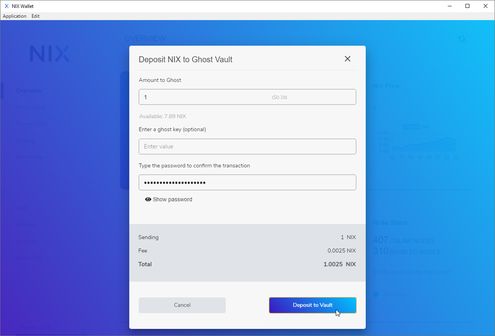

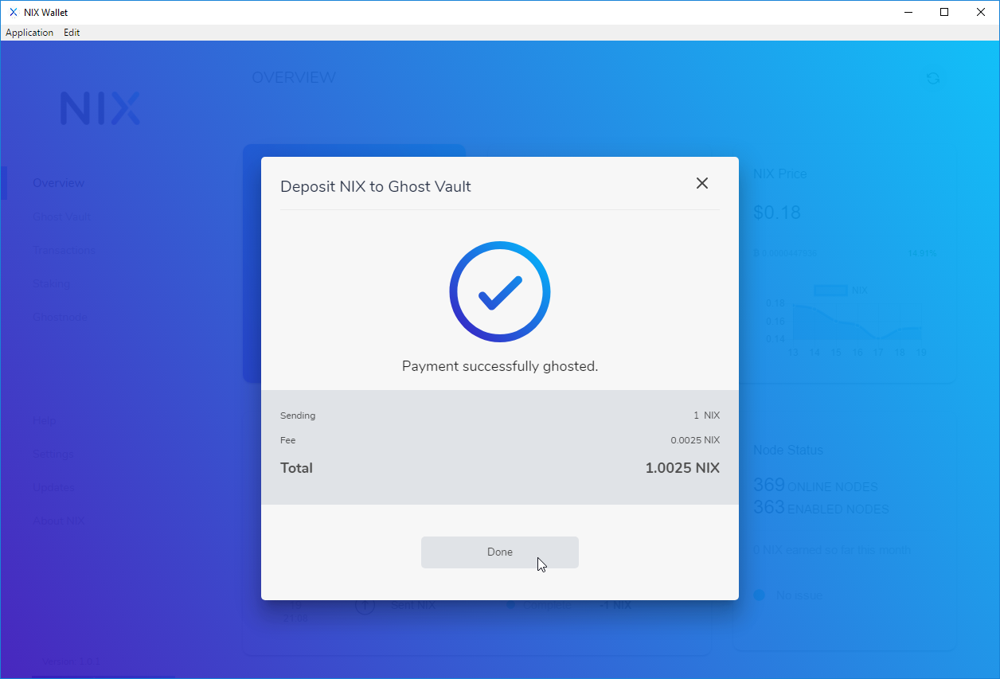

### From the Ghost Vault Menu

Select "Ghost Vault" from the menu on the left hand side of the UI wallet and click on "Deposit From Wallet"

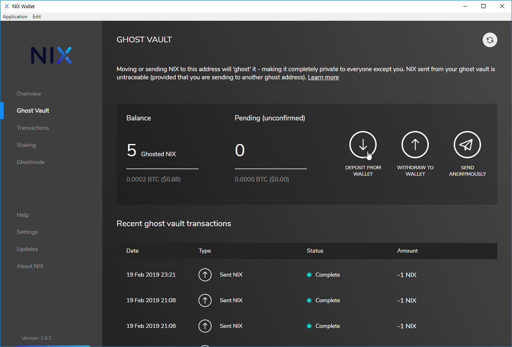

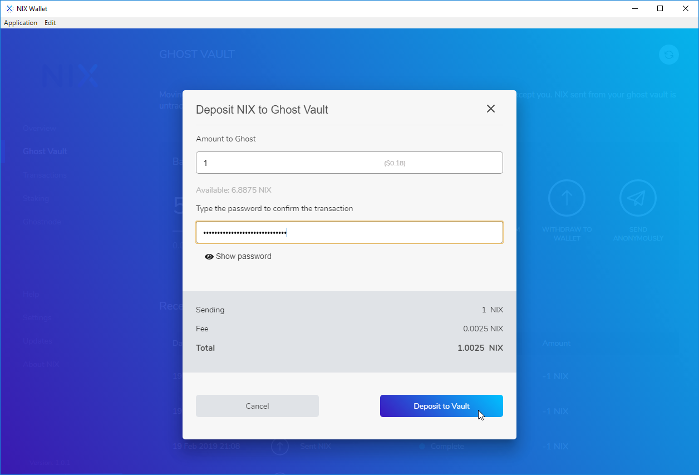

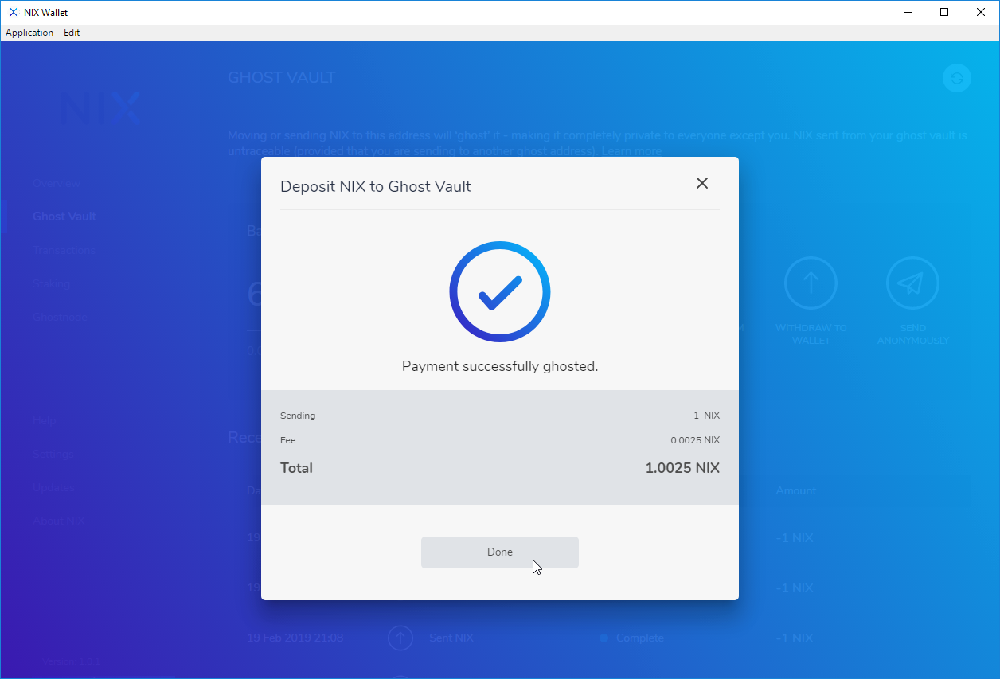

