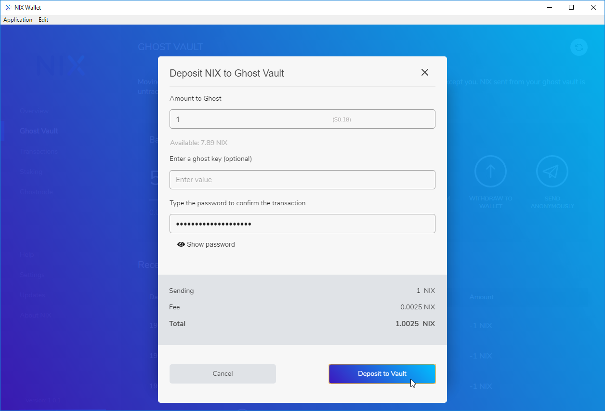

# 1-Way Ghosting

The procedure of sending coins to a Ghost Vault \(either your own or somebody else's\) is called “ghosting”, which essentially burns the coins and allows a user to re-issue them later as public coins with no attached history. Coins kept in the Ghost Vault remain private. The fee for ghosting your public NIX is 0.25%.

This feature was NIX’s first privacy transaction implementation and does not offer both sender and receiver privacy at the same time. If your transaction requires both, use [2-Way Ghosting](2-way-ghosting.md).

The Ghost Vault is currently only available in the QT and GUI wallets, with mobile wallet support planned for later release.


**TIP:** The longer your NIX are ghosted in your vault and the more ghosted NIX there are in total on the network, the stronger your privacy will be.


## QT Wallet Ghost Vault

### Adding Ghosted NIX to your wallet

To begin, open your qt-nix wallet and click on the "Ghost Vault" button and be sure you are looking at the "Ghost NIX to Vault" tab.

By default, NIX will be ghosted to your local wallet. If you wish to ghost them directly to another wallet, uncheck the "Ghost to Myself" box and paste in the receivers Ghost Key.


**NOTE:** Fractional amounts are currently only available in .1 increments.


Your ghosted NIX will show as unconfirmed while still in the memory pool waiting to be added to the blockchain. Once they are added to the blockchain they will show as Ghosted.

The above example of 1-Way Ghosting will privatize the receiving address as shown:

## GUI Wallet Ghost Vault

There are 2 ways to deposit funds into your Ghost Vault with the UI wallet.

### From the Overview screen

Within the Ghost Vault overview, click on the "Deposit" button.

### From the Ghost Vault Menu

Select "Ghost Vault" from the menu on the left hand side of the UI wallet and click on "Deposit From Wallet"

