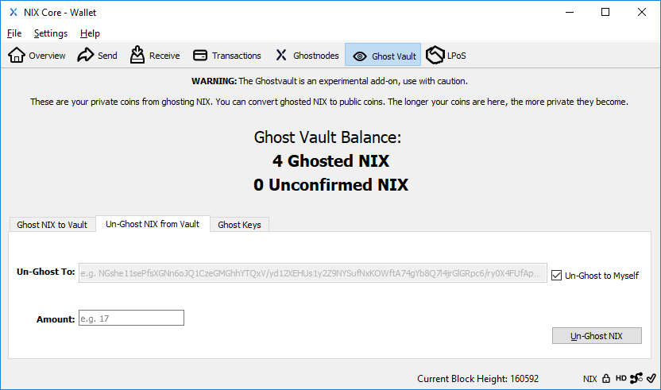
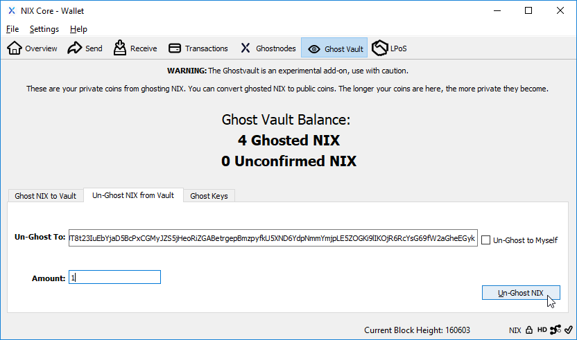
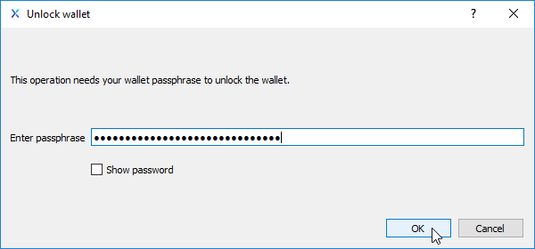
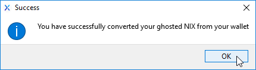
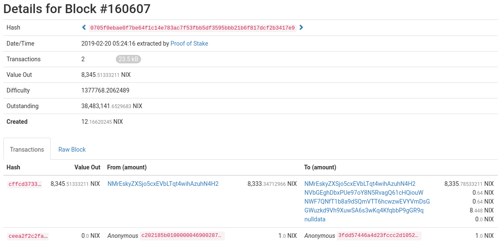

# 2-Way Ghosting

This never-done-before technology enables the ability to launch powerful private smart contracts on chain while allowing ZK-proof transaction edged privacy.

Although the technical procedure for achieving sender/receiver privacy in one transaction is complex in the backstage, it can be summarized as sending coins from one Ghost Vault to another. A brief technical overview can be seen in the [Commitment Key Pack Technical Paper](https://nixplatform.io/wp-content/uploads/2018/10/Commitment_Key_Packs_v1-0-1.pdf).

2-Way Ghosting is currently only available in the QT Wallet. Support in other wallets will be available.

## QT Wallet

You must first have [ghosted NIX in your Ghost Vault](untitled.md). You can begin your 2-way ghost transaction by clicking the "Ghost Vault" button followed by the "Un-Ghost NIX from Vault" tab.

Deselect the "Un-Ghost to Myself" checkbox, enter the recipients Ghost Key in the "Un-Ghost To: " input field and enter an amount of ghosted NIX to send.


**NOTE:** Decimal points are currently not allowed when un-ghosting/2-way ghosting NIX. Only whole number amounts are valid. Fractional amounts will be available in the future.


Your 2-Way Ghost transaction will then be added to the blockchain with both send and receive addresses privatized.

