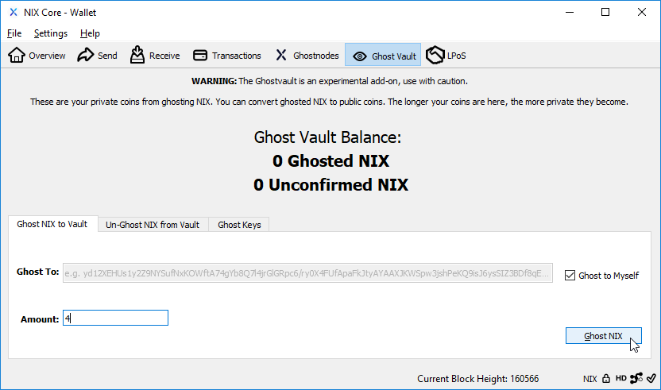
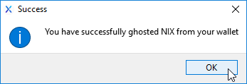
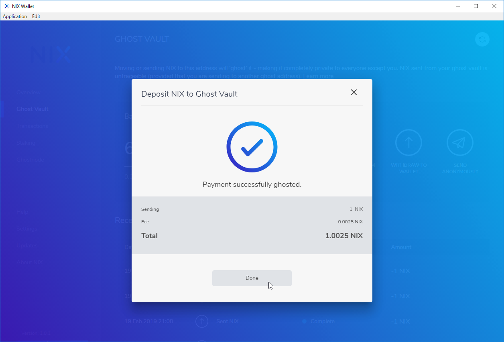

# Ghosting

The procedure of sending coins to the Ghost Vault is called “ghosting”, which provides the receiver with full privacy, as the destination is a hidden place and the sending address is public. Coins kept in the vault remain private. On the other hand, sending coins from the Ghost Vault to an address, is called “unghosting”; here the sending address, being represented by the vault, is private, giving sender privacy, yet the receiving address is a public and identifiable location.

Although this feature is NIX’s first privacy implementation, it does not offer sender and receiver privacy at once. If your transaction requires both sender and receiver privacy, see [2-Way Ghosting](2-way-ghosting.md).

The Ghost Vault is currently available in the QT and UI wallets, with mobile wallet support coming soon.


**TIP:** The longer your NIX are ghosted in your vault and the more ghosted NIX there are in total on the network, the stronger your privacy will be.


## QT Wallet Ghost Vault

To begin, open your qt-nix wallet and click on the "Ghost Vault" button and be sure you are looking at the "Ghost NIX to Vault" tab.

By default, NIX will be ghosted to your local wallet. If you wish to ghost them directly to another wallet, uncheck the "Ghost to Myself" box and paste in the receivers Ghost Key.


**NOTE:** Decimal points are currently not allowed when ghosting NIX. Only whole number amounts are valid. Fractional amounts will be available in the future.


Your ghosted NIX will show as unconfirmed while still in the memory pool waiting to be added to the blockchain. Once they are added to the blockchain they will show as Ghosted.

The above example of 1-Way Ghosting will privatize the receiving address as shown:

## UI Wallet Ghost Vault

There are 2 ways to deposit funds into your Ghost Vault with the UI wallet.

### From the Overview screen

Within the Ghost Vault overview, click on the "Deposit" button.

### From the Ghost Vault Menu

Select "Ghost Vault" from the menu on the left hand side of the UI wallet and click on "Deposit From Wallet"

