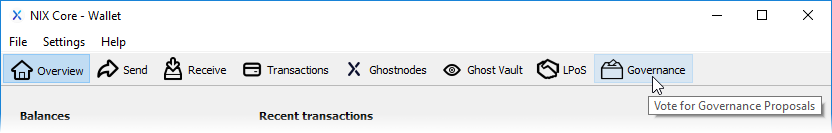
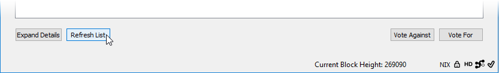

# Governance Voting

NIX incorporated its decentralized off-chain governance system on May 25th, 2019. Creating an off-chain governance model allows for a light-weight method of governance by ensuring that users who secure the network have a say in the direction NIX takes. This system prevents unnecessary blockchain data storage while at the same time maintaining transparency.

## Casting Your Vote

In order for a proposal to pass, 2 requirements from the voting community must be met. These are:

1. At least 50% of eligible votes are cast.
2. At least 75% of cast votes are in favor.

Voting is currently only available using the QT wallet. To be eligible for voting on a proposal you must be staking from a bech32 address which begins with "nix1" and/or running a Ghostnode prior to the date the proposal you'd like to vote on was submitted. Staking from a p2sh address beginning with "N" does not qualify for voting so as to keep those stakers who do not wish to participate in voting from affecting the 50% cast votes requirement.

Your vote weight is determined by your received "nix1" staking and/or Ghostnode rewards. As an example, lets say your "nix1" staking address\(es\) generated 20.1 NIX in the 30 days prior to a proposal submission. You would then have a total vote weight of 20.1 for that specific proposal. If you began staking after a proposal was submitted, your vote weight would be 0 for that particular proposal.

After navigating to the Governance section and populating/refreshing the proposal list, you may then select a specific proposal and review it by clicking on the "Expand Details" button. Once you've decided whether or not to support the proposal, make sure that proposal is selected then click either the "Vote Against" or "Vote For" button. You will then be prompted to enter your wallet password, after which your vote weight will be added to your selection.

## More Information

A list of active, accepted and rejected proposals can be [found here](https://governance.nixplatform.io/#/proposals).  
Also, you can find a detailed [Governance pdf here](https://nixplatform.io/wp-content/uploads/2019/02/NixGovernance.pdf).

