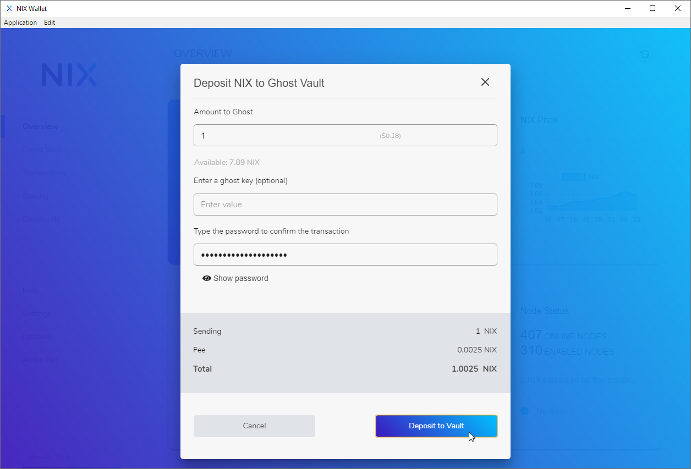
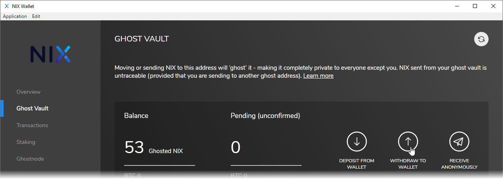
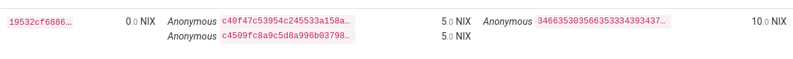

# Ghost Vault


All users must unghost any privatized funds before the chainswap takes place in the near future. Failure to do so will result in the complete loss of privatized funds! Privacy functions will be reintroduced in the update following the chainswap.


## 1-Way Ghosting


**NOTICE:** If you'd like to 1-Way ghost to a different wallet, use the optional ghost key field.


### From the Overview screen

From the Overview screen, find the "Ghost Vault" box and click on the "Deposit" button.

### From the Ghost Vault Menu

Select "Ghost Vault" from the menu on the left hand side of the UI wallet and click on "Deposit From Wallet"

This kind of transaction will privatize the receiving address when viewed with a block explorer.

## 2-Way Ghosting

Creating a 2-way ghost transaction can be done from the Ghost Vault screen. First, click on Ghost Vault from the left-hand menu, then click on the "Withdraw to Wallet" button.

Next, click on "Send to ghost key" and fill in the amount you wish to send, a ghost key for the vault you wish to send to. You will also need to enter your wallet password.

This transaction will privatize both sending and receiving addresses when viewed with a block explorer.

