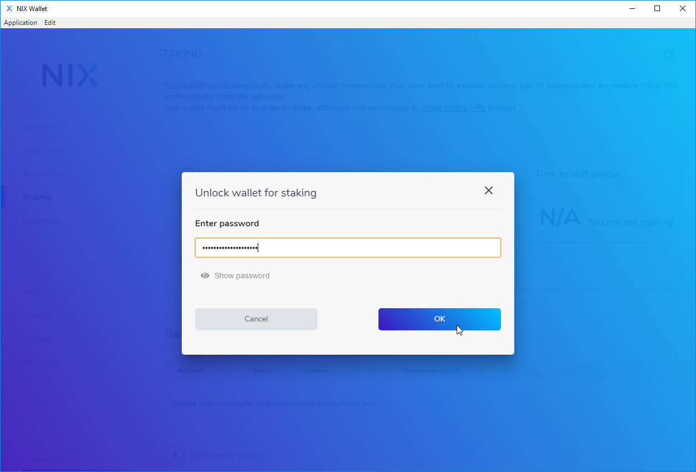

# In-Wallet Staking

Staking with the GUI Wallet is quite easy as well. Simply select "Staking" from the left-hand menu of the wallet and toggle the staking slider. You will then be prompted to enter in your wallet passphrase. 


**IMPORTANT:** You must leave your wallet open and "unlocked for staking" in order to actively stake your coins!  If you'd rather not leave your wallet open 24/7, consider using an [LPoS Merchant](https://nixplatform.io/marketplace).


## Advanced Configuration

You can enact finer control over staking by using [Wallet staking options](../../cli/command-line-options.md#wallet-staking-options) in your nix.conf configuration file.

