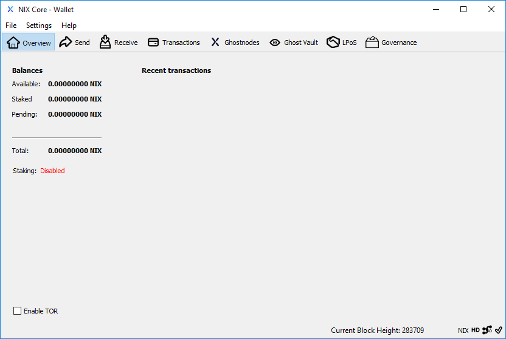

# QT Wallet

The NIX QT wallet is the one most cryptocurrency users have seen before. It offers a clean interface with a focus on full and complete functionality rather than design.

**Recommended for:** Everyone















