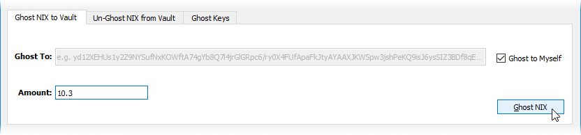

# Ghost Vault


All users must unghost any privatized funds before the chainswap takes place in the near future. Failure to do so will result in the complete loss of privatized funds! Privacy functions will be reintroduced in the update following the chainswap.


The procedure of sending coins to a Ghost Vault \(either your own or somebody else's\) is called “ghosting”, which essentially burns the coins and allows a user to re-issue them later as public coins with no attached history. Coins kept in the Ghost Vault remain private. The fee for ghosting your NIX is 0.25%, paid with publicly held NIX \(it does not get subtracted from your ghosted NIX\).

This feature was NIX’s first privacy transaction implementation and does not offer both sender and receiver privacy at the same time. If your transaction requires both, use [2-Way Ghosting](ghost-vault.md#2-way-ghosting).


**TIP:** The longer your NIX are ghosted in your vault and the more ghosted NIX there are in total on the network, the stronger your privacy will be.


## Ghost Keys

Ghost keys make it possible to receive funds into your Ghost Vault. The "key amount" refers to the number of individual denominations that a ghost key can accommodate. The denominations are 0.1, 1, 10, 100, 1000, 1000. As an example, if you wanted to ghost 532.6 NIX, you'd need a key amount of 4 or more to allow for the use of the 100, 10, 1, and .1 denominations. If in doubt, you can always safely use the default of 10 for any transaction.


**WARNING:** Unlike public addresses, specific ghost keys can **ONLY BE USED ONCE**. Once funds have been sent to a ghost key, sending to the same key again will result in lost funds! Only after your wallet receives funds on a specific ghost key will it then create a new one to replace it. Because of this, you should update your backup archive after every use of the Ghost Vault to be sure your backup wallet doesn't re-create an already used ghost key. The QT, UI  and CLI wallets will automatically create a backup in the ghostbackups directory of the main NIX data directory.


## 1-Way Ghosting

To begin, open your nix-qt wallet and click on the "Ghost Vault" button and be sure you are looking at the "Ghost NIX to Vault" tab.

### Sending to your own Ghost Vault

By default, your NIX will be ghosted to your own Ghost Vault. Outside observers will be unable to tell that you still maintain possession of them.

### Ghosting to another user's Ghost Vault

If you'd rather send your public NIX to a different wallet, uncheck the "Ghost to Myself" box and paste in the recipients Ghost Key.


**NOTE:** Fractional amounts are currently only available in .1 increments.


Your ghosted NIX will show as unconfirmed while still in the memory pool waiting to be added to the blockchain. Once they are added to the blockchain they will show as Ghosted.

The above examples of 1-Way Ghosting will privatize the transaction as shown:

### Un-Ghosting to another user's wallet

In cases where you only want to privatize your sending address, you can Un-Ghost funds from your Ghost Vault into a receivers public address. This method is done from the "Un-Ghost NIX from Vault" tab, and there is no fee for this type of transaction.

## 2-Way Ghosting

This never-done-before technology enables the ability to launch powerful private smart contracts on chain while allowing zero knowledge proof transaction edged privacy.

Although the technical procedure for achieving sender and receiver privacy in one transaction is complex in the backstage, it can be summarized as sending coins from one Ghost Vault to another. A brief technical overview can be seen in the [Commitment Key Pack Technical Paper](https://nixplatform.io/wp-content/uploads/2018/10/Commitment_Key_Packs_v1-0-1.pdf). There is a flat rate fee of .1 for these vault to vault transactions, paid from the senders Ghost Vault \(not subtracted from the transaction amount\).

### Creating a 2-Way Ghost Transaction

You must first have [ghosted NIX in your Ghost Vault](ghost-vault.md#sending-to-your-own-ghost-vault). You can begin your 2-Way Ghost transaction by clicking the "Ghost Vault" button followed by the "Un-Ghost NIX from Vault" tab.

Deselect the "Un-Ghost to Myself" checkbox, enter the recipients Ghost Key in the "Un-Ghost To: " input field and enter an amount of ghosted NIX to send.


**NOTE:** Fractional amounts are currently only available in .1 increments.


Your 2-Way Ghost transaction will then be added to the blockchain with both send and receive addresses privatized.

## 

