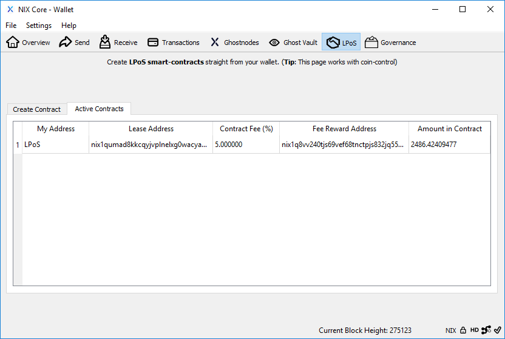

# LPoS Contracts

## Creating a Contract

Click on the LPoS tab at the top of the QT wallet to find the "Create Contract" screen. Here, you can fill in the required information in order to lease your coins to another wallet or provider.

**`Lease to:`** Defines the external address allowed to stake the coins. This address is supplied by the merchant.

**`Contract Label:`** \(optional\) A display tag for easier identification in the 'Active Contracts' tab.

**`Amount:`** The amount of NIX you wish to stake. Amounts follow coin control selections if enabled.

**`Fee Percent:`** Amount of reward share allocated to the leasing merchant. This info is provided by the merchant. If the fee is greater than zero, check the "Enable fee payout" box to enter the proper percentage.

**`Reward Address:`** The merchant's address for their share of the stake reward when your contract successfully stakes. This address is supplied by the merchant.

**`Owner Address:`** \(optional\) Allows you to specify a local address where your leased coins will be held. Creating multiple contracts with the same owner address allows merchants/cold staking services to combine contracts until a minimum number of coins are reached using the stakecombinethreshold=&lt;n&gt; configuration option \(default is 5000 coins\).

## Cancelling a Contract

First, navigate to the "Active Contracts" tab from the LPoS screen.


**NOTE:** Active contracts that have recently hit a stake will not show until those coins have matured \(201 confirmations\).


To cancel an active contract, simply select it and then right click.

## More Information

You can find a list of LPoS merchants or learn how to install your own cold staking server here:



