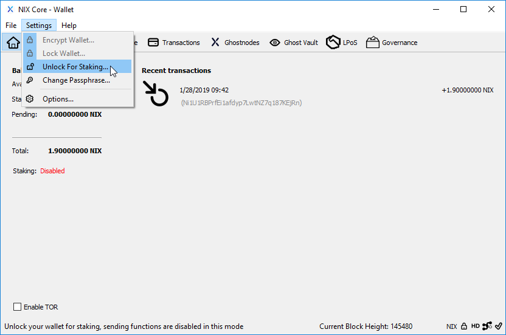
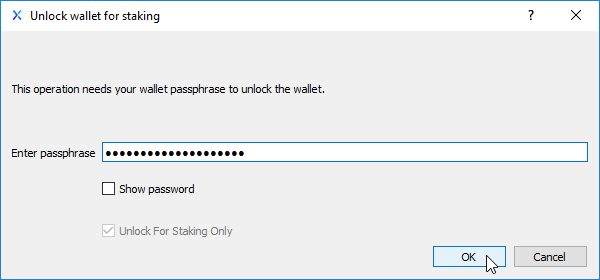
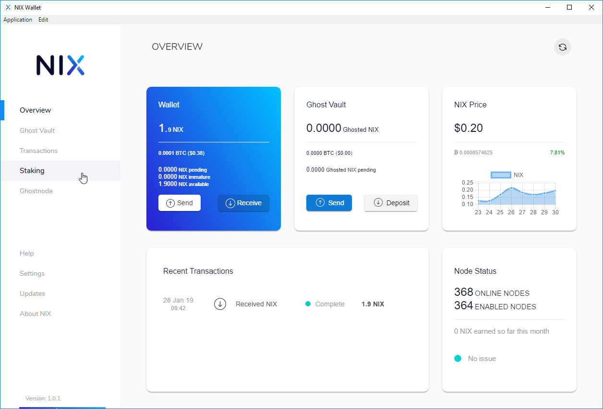
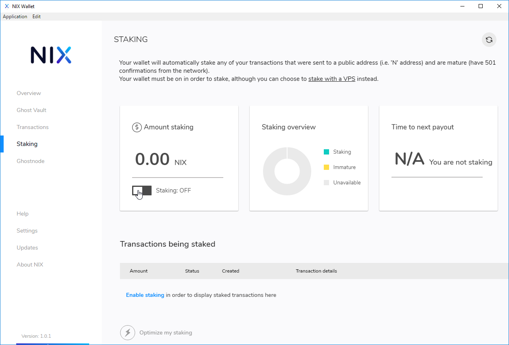
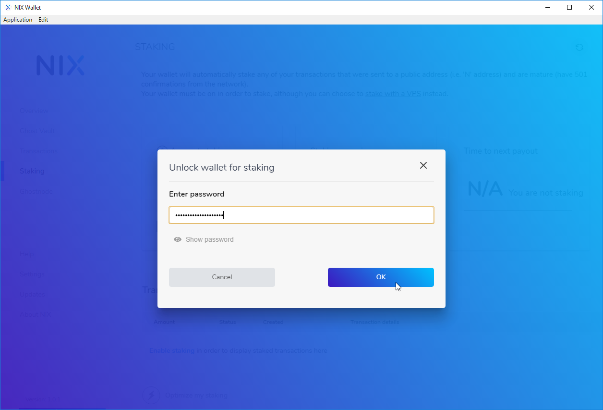
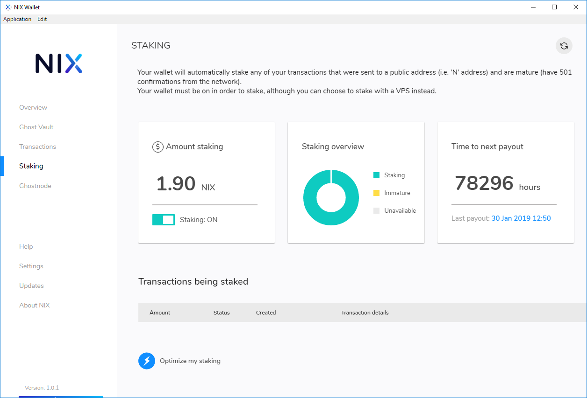

# Wallet Staking

## QT Wallet

In order to stake your coins from the QT Wallet you must first [encrypt your wallet](../backup-and-security-1/qt-wallet-encryption.md). You cannot stake from a wallet that is not encrypted.

Simply select "Unlock For Staking..." from the Settings menu and enter in your wallet passphrase.


**IMPORTANT:** You must leave your wallet open and "unlocked for staking" in order to actively stake your coins!


## UI Wallet

Staking with the UI Wallet is quite easy as well. Simply select "Staking" from the left-hand menu of the wallet and toggle the staking slider. You will then be prompted to enter in your passphrase. 


**IMPORTANT:** You must leave your wallet open and "unlocked for staking" in order to actively stake your coins!


## Advanced Configuration

You can enact finer control over staking by using [Wallet staking options](../command-line-options.md#wallet-staking-options) in your nix.conf configuration file.

