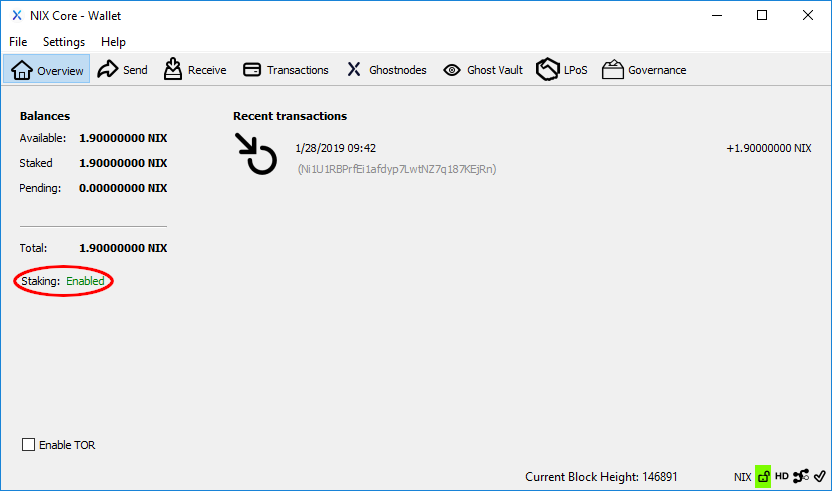

# Wallet Staking

## QT Wallet

In order to stake your coins from the QT Wallet you must first [encrypt your wallet](../backup-and-security-1/qt-wallet-encryption.md). You cannot stake from a wallet that is not encrypted.

Simply select "Unlock For Staking..." from the Settings menu and enter in your wallet passphrase.


**IMPORTANT:** You must leave your wallet open and "unlocked for staking" in order to actively stake your coins!


## UI Wallet

Staking with the UI Wallet is quite easy as well. Simply select "Staking" from the left-hand menu of the wallet and toggle the staking slider. You will then be prompted to enter in your passphrase. 


**IMPORTANT:** You must leave your wallet open and "unlocked for staking" in order to actively stake your coins!


## Advanced Configuration

You can enact finer control over staking by using the following options in your nix.conf configuration file:

`stakesplitthreshold=<n>` Maximum amount of coins to stake before splitting into two outputs. \(default: 20000\)

`stakecombinethreshold=<n>` Minimum amount of NIX to combine into one stake if wallet has multiple outputs to stake. \(default: 5000\)

`maxstakecombine=<n>` Maximim of outputs to combine when achieving stakecombinethreshold. \(default: 3\)

#### Additional options include:

`minstakeinterval=<n>` Minimum time in seconds between successful stakes \(default: 0\)

`minersleep=<n>` Milliseconds between stake attempts. Lowering this param will not result in more stakes. \(default: 500\)

`reservebalance=<amount>` Ensure available balance remains above reservebalance. \(default: 0\)

`donationpercent=<n>` Percentage of block reward donated to the donation address. e.g. 1190 \(11.90%\) \(default: 0\)

`donationaddress=<n>` Destination to send donated staking rewards. \(default: N/A\)

