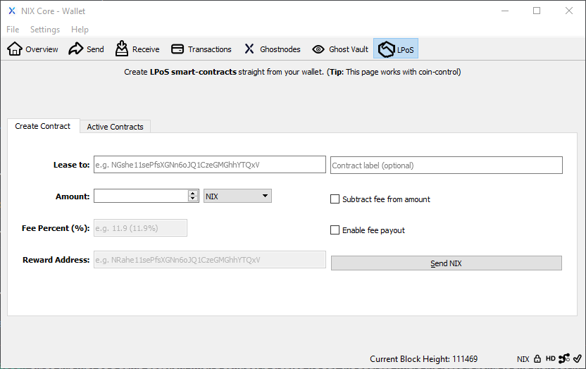

# Lease Staking \(LPoS\)

You can utilise the LPoS 'Create Contract' screen to create both Cold Staking and Leased Proof-of-Stake smart contracts that operate in a trustless manner until you decide to cancel the contract. 

This means any coin owner can delegate their staking power to any third-party staking merchant \(who may charge a fee for their services\) and receive regular staking rewards - without needing to worry about the technicalities of keeping a wallet open, updated and unlocked for staking.

### Create Contract 

**Cold-Staking -** you only need to point the Lease-to address to your VPS hot wallet, set the Amount and click 'Send NIX'. You'll be required to input your encryption password. Confirmations are required in the normal fashion before the coins become stakeable in the external watch balance.

**Lease Proof-of-Stake -** if a merchant doesn't charge a fee for their staking services then the process is exactly the same as Cold-Staking. If they do charge a fee then you need to click the 'Enable fee payout' option to configure the other LPoS parameters in line with the merchant's terms of service.


**Staking Merchants** - see [Merchant Info](merchant-info.md) for contract assurance start-up flags.  


**`Lease to:`** Defines the external address allowed to stake the coins.

**`Contract Label:`** A display tag for easier identification in 'Active Contracts'

**`Amount:`** Operates as the same option in 'Send' and follows coin control.


**Leased staking -** if the merchant requests a fee, click **'Enable fee payout'**  to enable the Fee Percent & Reward Address options.


**`Fee Percent:`** Amount of reward share allocated to the leasing merchant. 

**`Reward Address:`** The merchants cold storage address for their share of staking reward. 

### Active Contracts



