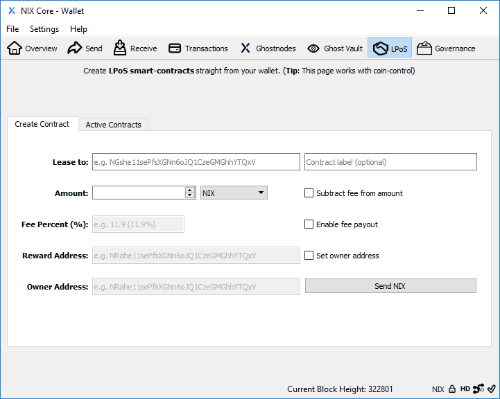
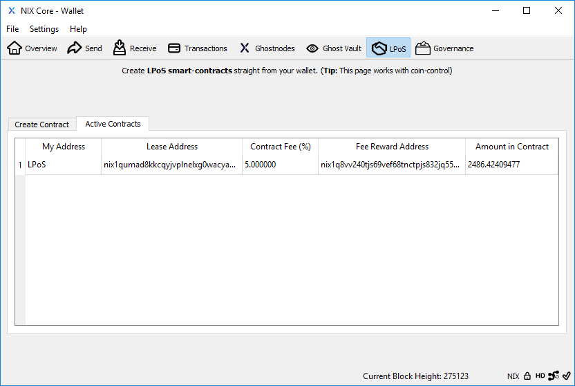
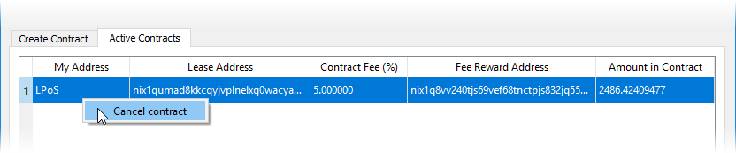
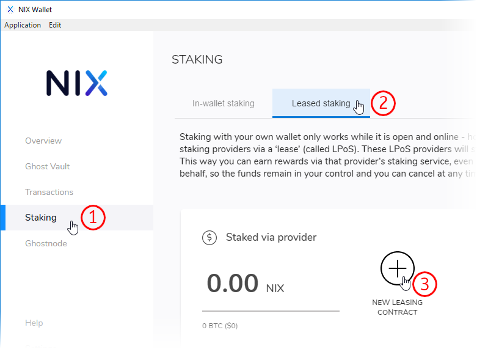
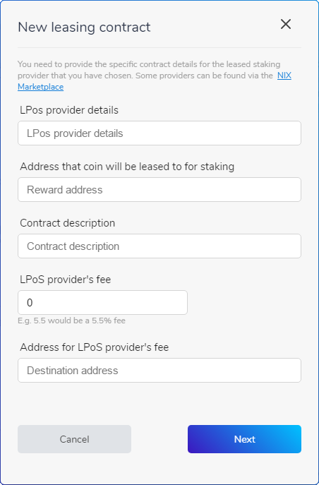
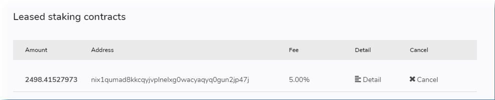

# LPoS Client

You can utilize the LPoS 'Create Contract' screen to create both Cold Staking and Leased Proof-of-Stake smart contracts that operate in a trustless manner until you decide to cancel the contract. 

This means any coin owner can lease their staking rights to any third-party staking merchant \(who may charge a fee for their services\) to receive staking rewards without needing to worry about the technicalities of keeping a wallet open, updated and unlocked for staking. Such LPoS service providers can be found in the [NIX marketplace](https://nixplatform.io/marketplace).

As mentioned, there are 2 ways to use this smart contract:

**Independent Cold Staking -** After setting yourself up an [LPoS cold staking wallet](lpos-server.md), simply point the 'Lease to' address to an address generated by your servers wallet, specify an amount you wish to stake and click 'Send NIX'. You'll be required to input your encryption password if one is set.

**Using an LPoS Merchant -** If a merchant doesn't charge a fee for their staking services, then the process is exactly the same as Cold Staking. If they do charge a fee then you'll need to click the 'Enable fee payout' box before being able to enter a Fee Percent and Reward Address. **Failure to properly enter the merchants provided information will result in your contract being unable to stake and earn rewards.**

## QT Wallet

### Create a Contract

Click on the LPoS tab at the top of the QT wallet to find the "Create Contract" screen. Here, you can fill in the required information in order to lease your coins to another wallet or provider.

**`Lease to:`** Defines the external address allowed to stake the coins. This address is supplied by the merchant.

**`Contract Label:`** A display tag for easier identification in the 'Active Contracts' tab.

**`Amount:`** The amount of NIX you wish to stake. Amounts follow coin control selections if enabled.

**`Fee Percent:`** Amount of reward share allocated to the leasing merchant. This info is provided by the merchant. If the fee is greater than zero, check the "Enable fee payout" box to enter the proper percentage.

**`Reward Address:`** The merchant's address for their share of the stake reward when your contract successfully stakes. This address is supplied by the merchant.

### Cancel a Contract

First, navigate to the "Active Contracts" tab from the LPoS screen.


**NOTE:** Active contracts that have recently hit a stake will not show until those coins have matured \(201 confirmations\).


To cancel an active contract, simply select it and then right click.

## GUI Wallet

### Create a Contract

First, click on "Staking" in the left-hand menu, then "Leased staking" followed by "NEW LEASING CONTRACT"

**`LPoS provider details:`** Can be set to anything you like.

**`Address that coins will be leased to for staking:`** Defines the external address allowed to stake the coins. This address is supplied by the merchant.

**`Contract description:`** Can be set to anything you like.

**`LPoS provider's fee:`** Amount of reward share allocated to the leasing merchant. This info is provided by the merchant.

**`Address for LPoS provider's fee:`** The merchant's address for their share of the stake reward when your contract successfully stakes. This address is supplied by the merchant.

### Cancel a Contract

At the bottom of the Leased Staking window, you'll find the active contracts list. Here, you can view details and cancel any of your LPoS contracts.


**NOTE:** Active contracts that have recently hit a stake will not show until those coins have matured \(201 confirmations\).


