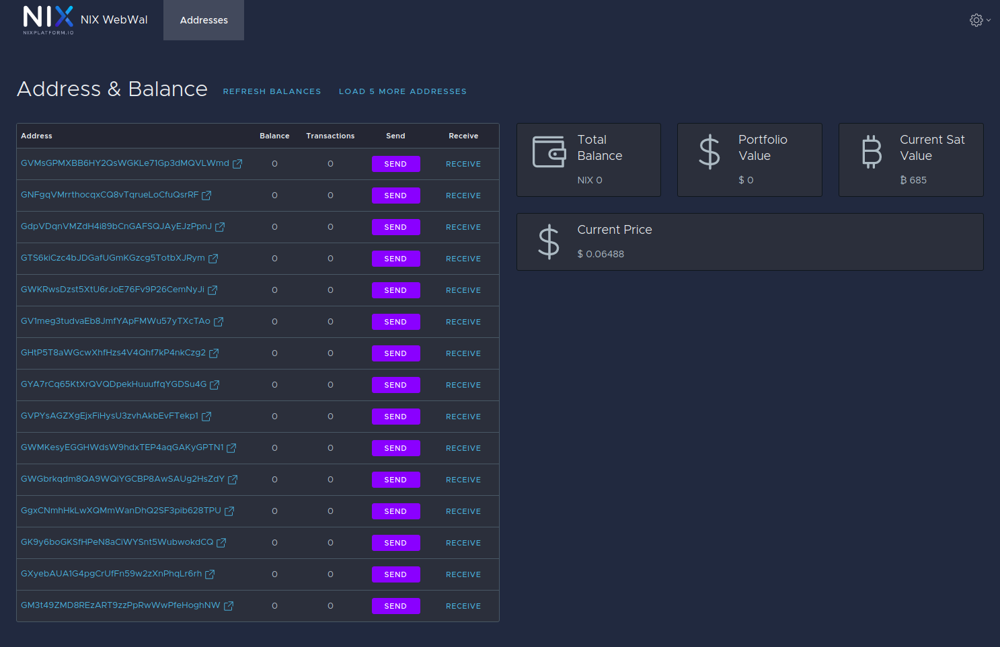

# Web Wallet

The [NIX Web Wallet](https://webwallet.nixplatform.io/) offers a very convenient way to send and receive NIX coins. It can be used as a quick and easy storage option for new and long-time users alike. The 12 word seed phrase is BIP32/39 complaint, making it compatible with Flare Wallet seed phrases \(though currently limited to G addresses only\).

**Recommended for:** Everyone









