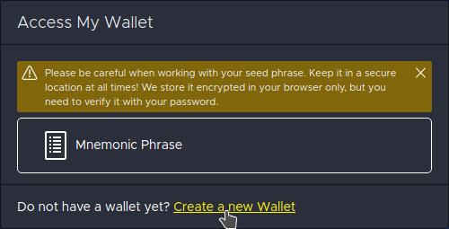
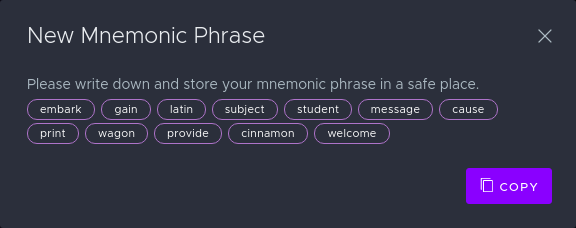
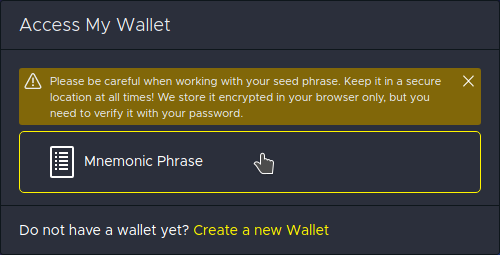
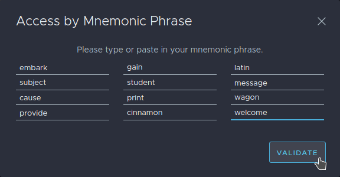
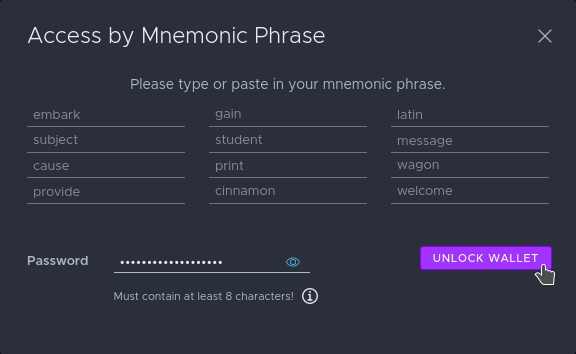

# Create Wallet

You can generate a new seed phrase by finding the "create a new wallet" link.

Your browser will then be used to generate a new seed phrase. At no time will any seed phrase information ever be collected. Seed phrases are encrypted and stored locally on your device.

After writing down your seed phrase \(in order\), close the window and click on the "Mnemonic Phrase" button.

