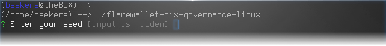
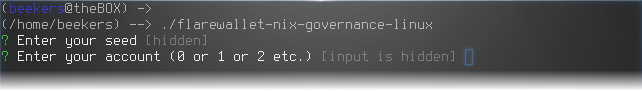
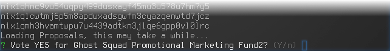
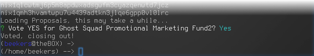

# Governance Voting

While you cannot currently vote for a governance proposal directly in the Flare wallet, you can use the [Flare NIX Governance command line utility](https://github.com/NixPlatform/flarewallet-nix-gov-binaries) using a Windows, MacOS, or Linux computer.

[Download Flare NIX Governance Utility for Windows](https://github.com/NixPlatform/flarewallet-nix-gov-binaries/blob/master/flarewallet-nix-governance-win.exe)  
[Download Flare NIX Governance Utility for MacOS](https://github.com/NixPlatform/flarewallet-nix-gov-binaries/blob/master/flarewallet-nix-governance-macos)  
[Download Flare NIX Governance Utility for Linux](https://github.com/NixPlatform/flarewallet-nix-gov-binaries/blob/master/flarewallet-nix-governance-linux)

### Run the program and enter your seed phrase


**WARNING:** If you run this on a compromised system, your funds may be at risk.



**TIP:** Linux users will have to make the binary executable by running "chmod +x flarewallet-nix-governance-linux"


### Choose an account to vote with

If you are not using multiple accounts, choose 0. If you do have multiple accounts that are eligible to vote with, vote with each account separately.

### Cast your vote

Active proposals will show up by title name. Please review each proposal carefully and discuss them with the community in the discord server if you have any questions. Once completed, there is no changing your vote. You can view the details for each Proposal on the [Governance page](https://governance.nixplatform.io/#/proposals).

Press Y or N to vote

### Done!

After the utility has finished, it will close \(and likely the command prompt window with it\).

