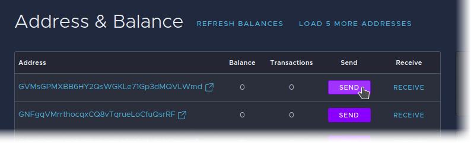

# Sending and Receiving

## Receiving Funds

Click on the Receive button for any address you'd like to fund to bring up a copy to clipboard link and qr code.

After you've received funds, you may need to refresh your balance. Clicking on the address will show its transaction history.

## Sending Funds

Use the "Send" button to send from an address.

Fill in the Target Address and Amount fields. Change is kept on the same address by default, but you can optionally specify a different change address if you like.

